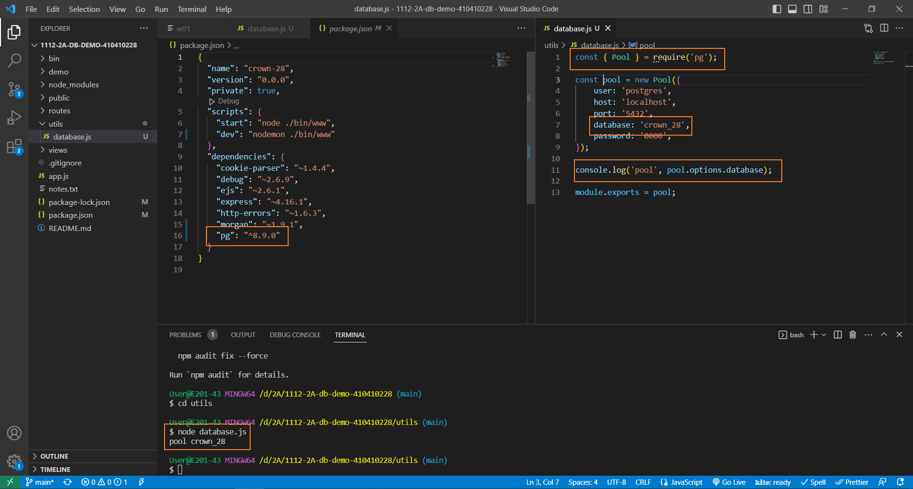
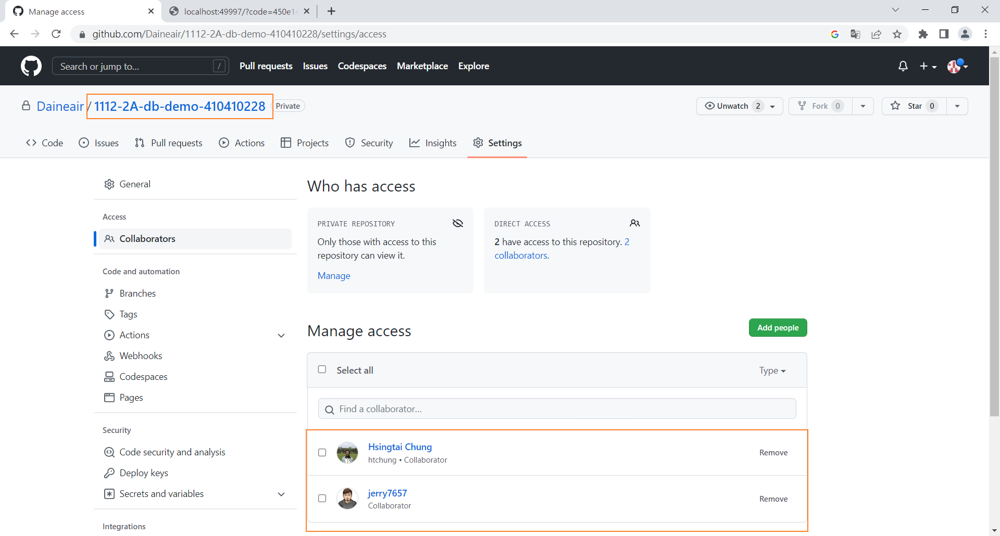
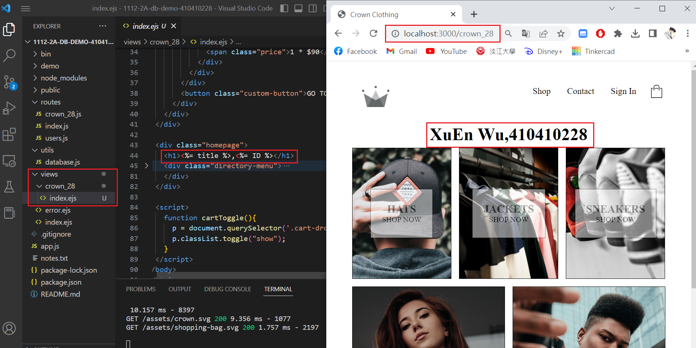
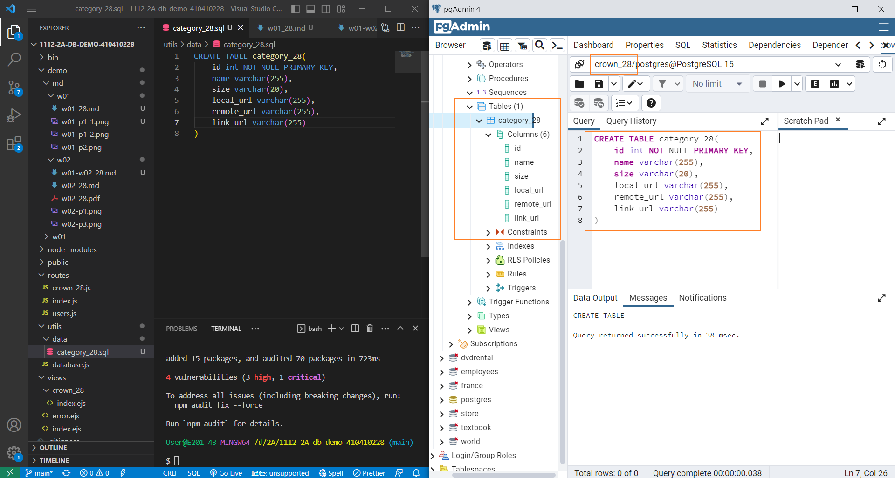
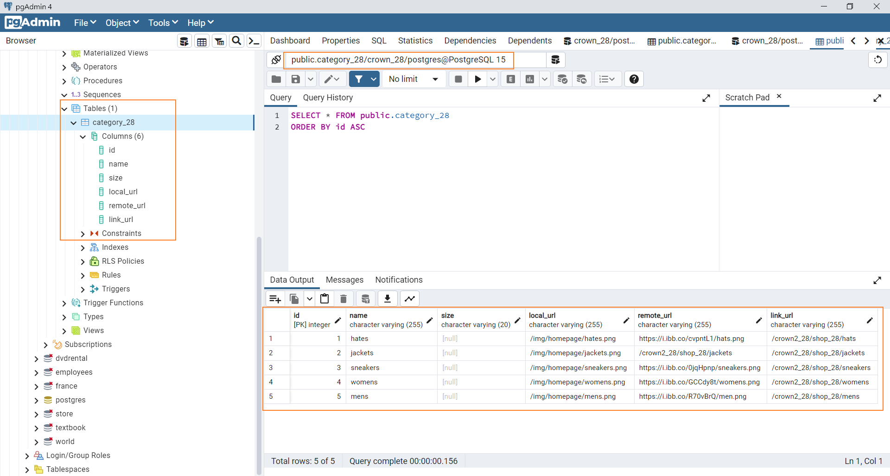
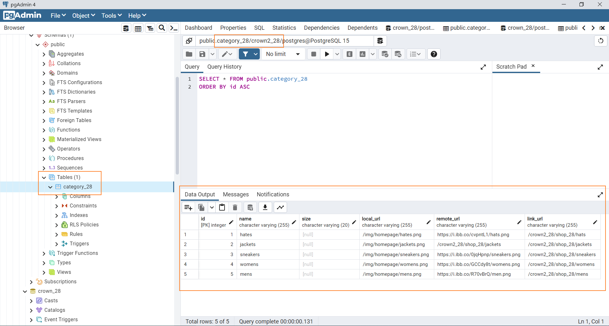

[My Github Repo URL](https://github.com/Daineair/1112-2A-db-demo-410410228)

### W02-P1: 資料庫連線及測試連線，要顯示資料庫 crown_28 名稱



### W02-P2: 邀請老師及助教



### W02-P3: 建立路由 /crown_28 顯示 crown_28/index.ejs



### W02-P4: create table crown_28 using SQL command



### W02-P5: insert 5 data into category_28 using SQL command



### W02-P6: backup crown_28 database, and restore the data into another database crown2_28



### Github logs of Week 02

```

$ git log --pretty=format:"%h%x09%an%x09%ad%x09%s" --after="2023-2-21"
6a81d8b Daineair        Fri Feb 24 12:27:03 2023 +0800  add demo/md/w2-p6/files
8bc9216 Daineair        Thu Feb 23 18:06:12 2023 +0800  add demo/md/w02-3
15eeacf Daineair        Thu Feb 23 14:23:31 2023 +0800  add demo/w02-p3/ files
ea335b1 Daineair        Thu Feb 23 00:35:19 2023 +0800  add demo/md/w02/ files
55c9a60 Daineair        Wed Feb 22 15:06:09 2023 +0800  W02-P3: 建立路由 /crown_xx 顯示 crown_xx/index.ejs
8336840 Daineair        Wed Feb 22 13:30:51 2023 +0800  add demo/w01 code
```
