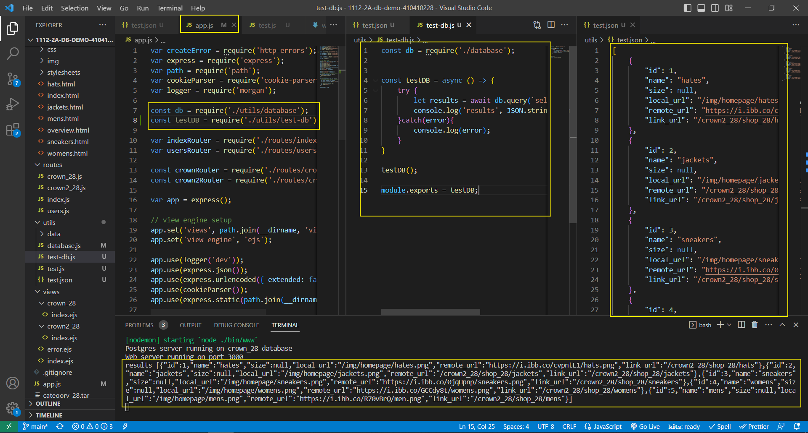
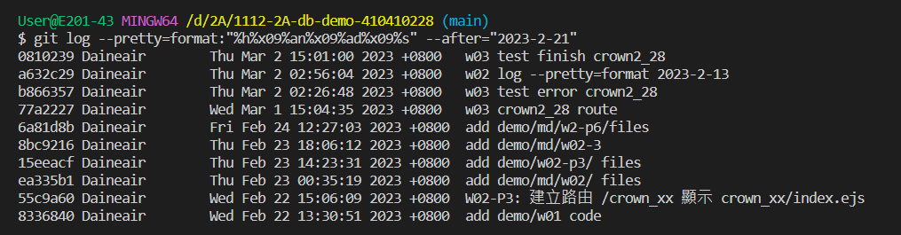

[My Github Repo URL](https://github.com/Daineair/1112-2A-db-demo-410410228)

### W03-P1: test-db.js can retrieve 5 data of category_28 tables



### W03-P2: fetch category data and replace crown2_xx/index.ejs with these data


### Github logs of Week 01~03



```
$ git log --pretty=format:"%h%x09%an%x09%ad%x09%s" --after="2023-2-21"
b866357 Daineair        Thu Mar 2 02:26:48 2023 +0800   w03 test error crown2_28
77a2227 Daineair        Wed Mar 1 15:04:35 2023 +0800   w03 crown2_28 route
6a81d8b Daineair        Fri Feb 24 12:27:03 2023 +0800  add demo/md/w2-p6/files
8bc9216 Daineair        Thu Feb 23 18:06:12 2023 +0800  add demo/md/w02-3
15eeacf Daineair        Thu Feb 23 14:23:31 2023 +0800  add demo/w02-p3/ files
ea335b1 Daineair        Thu Feb 23 00:35:19 2023 +0800  add demo/md/w02/ files
55c9a60 Daineair        Wed Feb 22 15:06:09 2023 +0800  W02-P3: 建立路由 /crown_xx 顯示 crown_xx/index.ejs
8336840 Daineair        Wed Feb 22 13:30:51 2023 +0800  add demo/w01 code

```