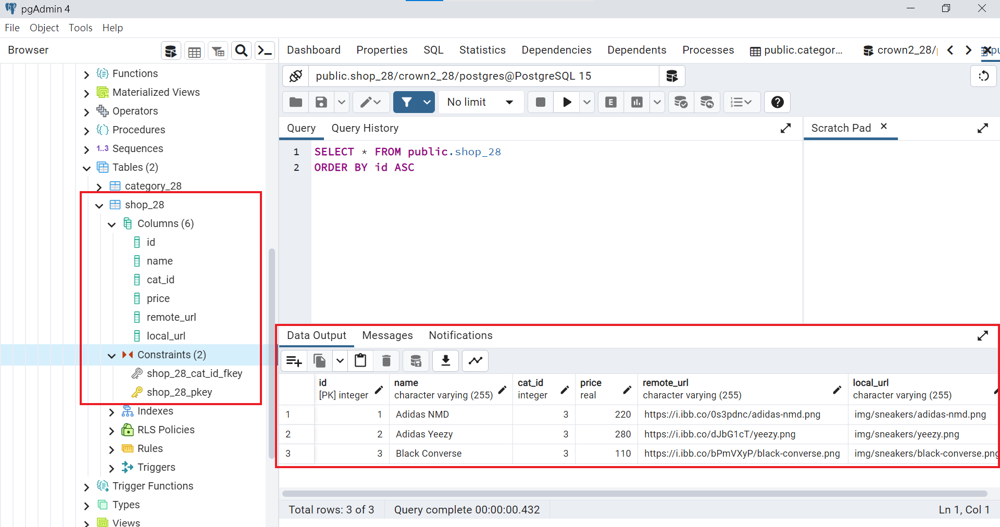
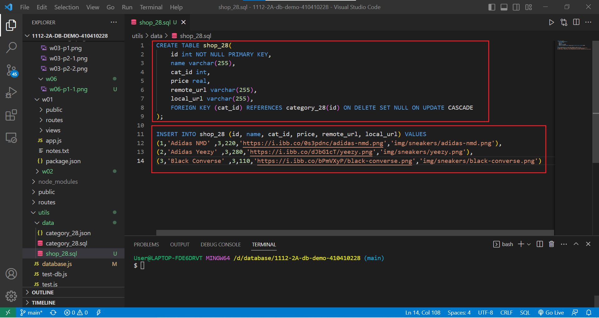
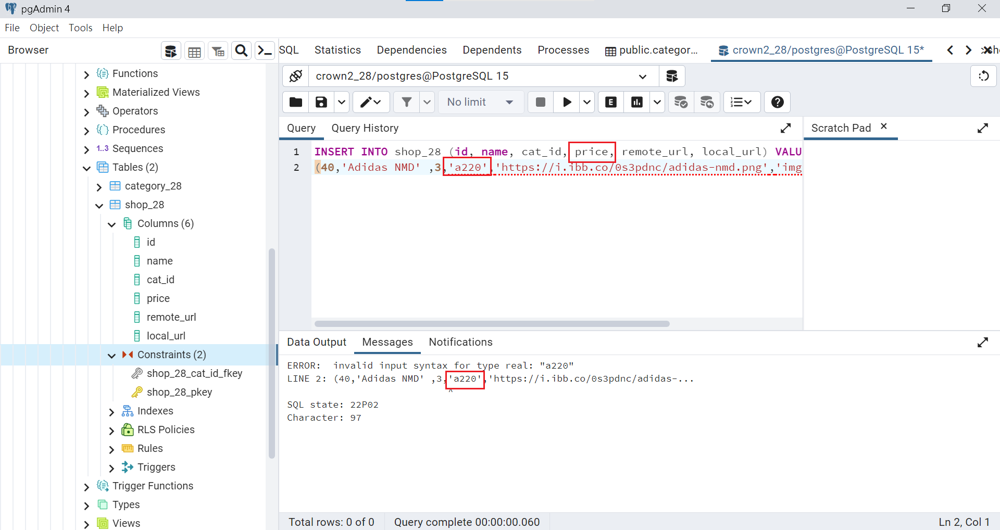
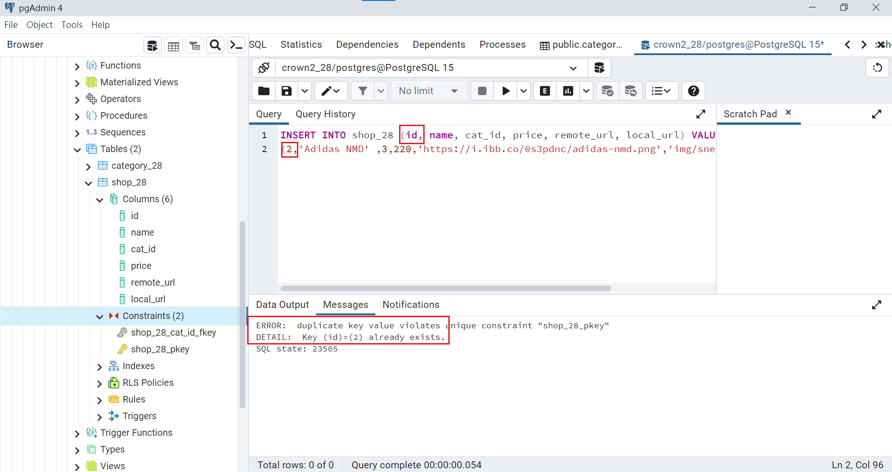
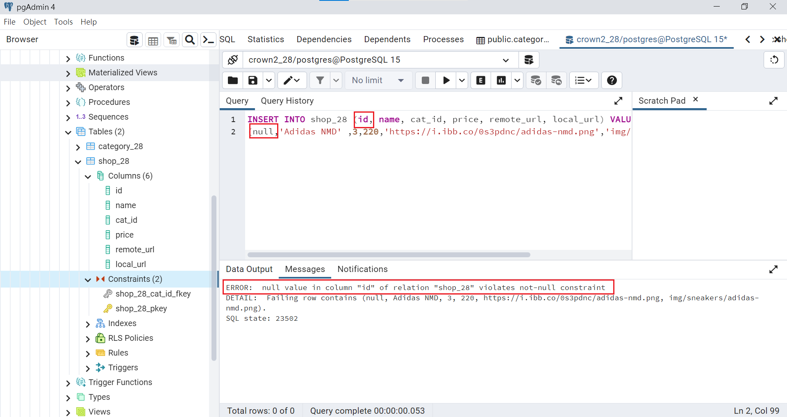
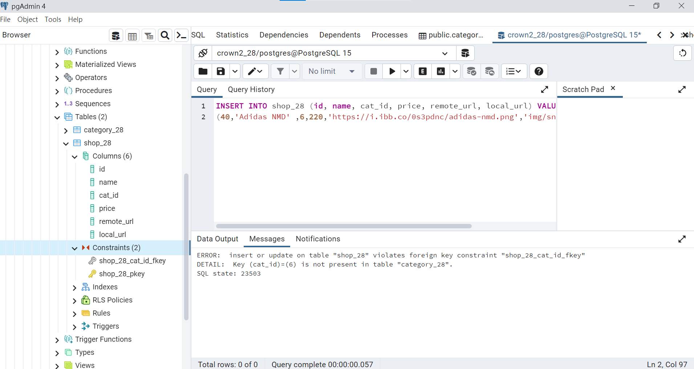
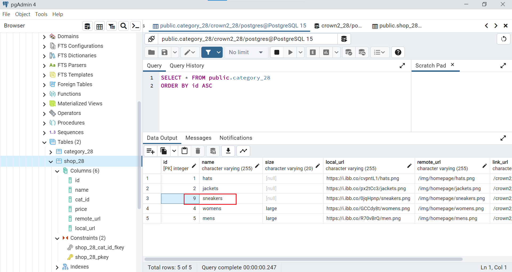
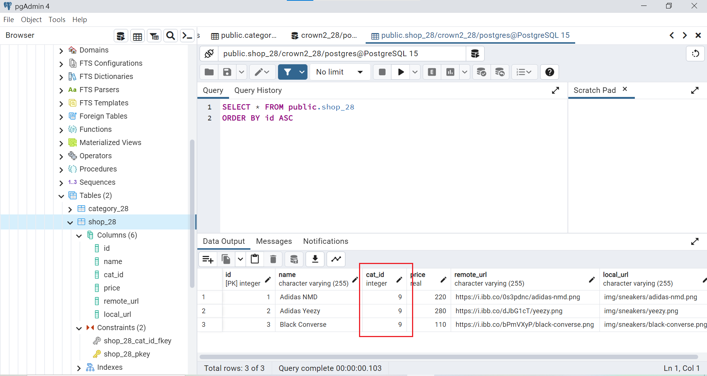
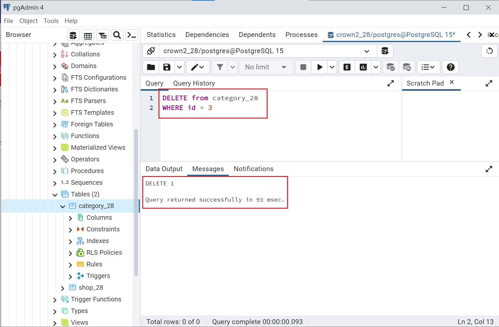
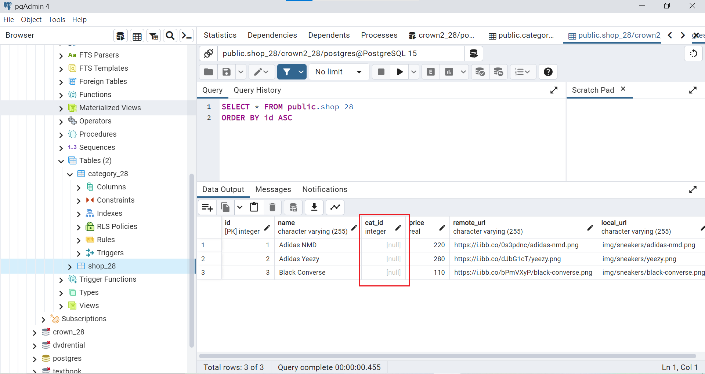

[My Github Repo URL](https://github.com/Daineair/1112-2A-db-demo-410410228)

### W06-P1: use SQL command to create shop_xx with 3 data (category is your ID's last digit)

 

### W06-P2: Relational Model Constraints

定義域限制 (domain constraints)

 
關聯鍵限制 (primary key constraints)

 
實體完整限制 (entity integrity constraitns)

 
參考完整限制 (referential integrity constraint)

### W06-P3: ON UPDATE CASCASE
 

 

### W06-P4: ON DELETE SET NULL
 

 

### Github logs of Week 06

$ git log --pretty=format:"%h%x09%an%x09%ad%x09%s" --after="2023-3-21"
589cd292        Daineair        Thu Mar 23 01:45:37 2023 +0800  delete w3schools
7ed8b0fc        Daineair        Thu Mar 23 01:34:02 2023 +0800  w06 p4 not 0323